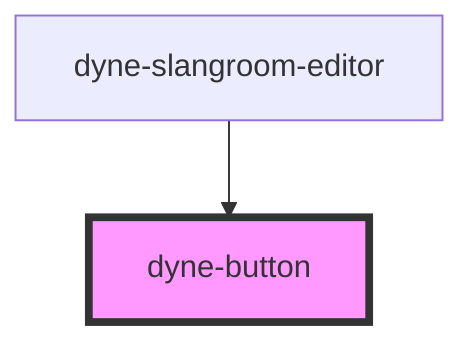

# dyne-button

<!-- Auto Generated Below -->

## Properties

| Property   | Attribute  | Description                                                 | Type     | Default      |
| ---------- | ---------- | ----------------------------------------------------------- | -------- | ------------ |
| `color`    | `color`    | button color could be: 'primary', 'secondary' or 'tertiary' | `string` | `'primary'`  |
| `emphasis` | `emphasis` | button emphasis could be: 'slight', 'moderate' or 'high'    | `string` | `'moderate'` |
| `size`     | `size`     | button sizes could be: 'small', 'medium' or 'large'         | `string` | `'medium'`   |

## Dependencies

### Used by

 - [dyne-slangroom-editor](../dyne-slangroom-editor)

### Graph

----------------------------------------------

*Built with [StencilJS](https://stenciljs.com/)*
