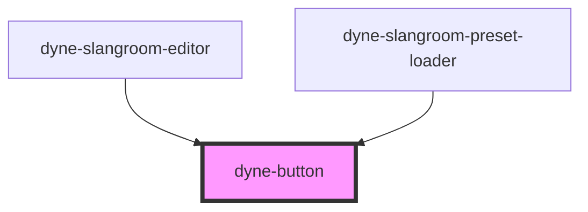

# dyne-button

<!-- Auto Generated Below -->

## Properties

| Property   | Attribute  | Description                                                 | Type                                                                 | Default      |
| ---------- | ---------- | ----------------------------------------------------------- | -------------------------------------------------------------------- | ------------ |
| `color`    | `color`    | button color could be: 'primary', 'secondary' or 'tertiary' | `"primary" \| "secondary" \| "tertiary" \| undefined`                | `'primary'`  |
| `emphasis` | `emphasis` | button emphasis could be: 'slight', 'moderate' or 'high'    | `"h" \| "high" \| "m" \| "moderate" \| "s" \| "slight" \| undefined` | `'moderate'` |
| `size`     | `size`     | button sizes could be: 'small', 'medium' or 'large'         | `"large" \| "medium" \| "small" \| undefined`                        | `'medium'`   |

## Dependencies

### Used by

 - [dyne-slangroom-editor](../dyne-slangroom-editor)
 - [dyne-slangroom-preset-loader](../dyne-slangroom-preset-loader)

### Graph

----------------------------------------------

*Built with [StencilJS](https://stenciljs.com/)*
