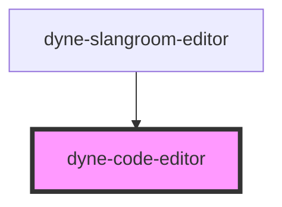

# dyne-slangroom-editor

<!-- Auto Generated Below -->

## Properties

| Property | Attribute | Description | Type                | Default                      |
| -------- | --------- | ----------- | ------------------- | ---------------------------- |
| `class`  | `class`   |             | `string`            | `''`                         |
| `config` | --        |             | `EditorStateConfig` | `{ extensions: basicSetup }` |
| `id`     | `id`      |             | `string`            | `nanoid(5)`                  |

## Methods

### `getContent() => Promise<string>`

#### Returns

Type: `Promise<string>`

### `setContent(text: string) => Promise<void>`

#### Parameters

| Name   | Type     | Description |
| ------ | -------- | ----------- |
| `text` | `string` |             |

#### Returns

Type: `Promise<void>`

## Dependencies

### Used by

 - [dyne-slangroom-editor](../dyne-slangroom-editor)

### Graph

----------------------------------------------

*Built with [StencilJS](https://stenciljs.com/)*
