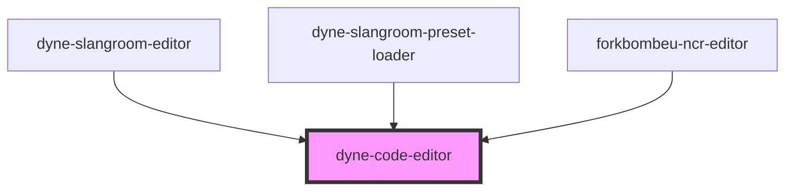

# dyne-slangroom-editor

<!-- Auto Generated Below -->

## Properties

| Property  | Attribute | Description | Type                | Default                      |
| --------- | --------- | ----------- | ------------------- | ---------------------------- |
| `class`   | `class`   |             | `string`            | `''`                         |
| `config`  | --        |             | `EditorStateConfig` | `{ extensions: basicSetup }` |
| `content` | `content` |             | `string`            | `''`                         |
| `name`    | `name`    |             | `string`            | `nanoid(5)`                  |

## Methods

### `getContent() => Promise<string>`

#### Returns

Type: `Promise<string>`

### `setContent(text: string) => Promise<void>`

#### Parameters

| Name   | Type     | Description |
| ------ | -------- | ----------- |
| `text` | `string` |             |

#### Returns

Type: `Promise<void>`

## Dependencies

### Used by

 - [dyne-slangroom-editor](../dyne-slangroom-editor)
 - [dyne-slangroom-preset-loader](../dyne-slangroom-preset-loader)
 - [forkbombeu-ncr-editor](../forkbombeu-ncr-editor)

### Graph

----------------------------------------------

*Built with [StencilJS](https://stenciljs.com/)*
