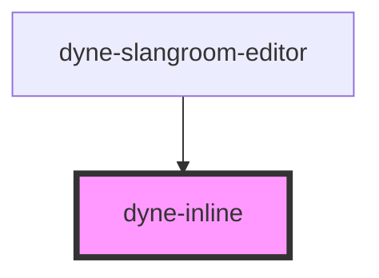

# dyne-inline

<!-- Auto Generated Below -->

## Properties

| Property | Attribute | Description | Type     | Default |
| -------- | --------- | ----------- | -------- | ------- |
| `gap`    | `gap`     |             | `number` | `4`     |

## Dependencies

### Used by

 - [dyne-slangroom-editor](../dyne-slangroom-editor)

### Graph

----------------------------------------------

*Built with [StencilJS](https://stenciljs.com/)*
