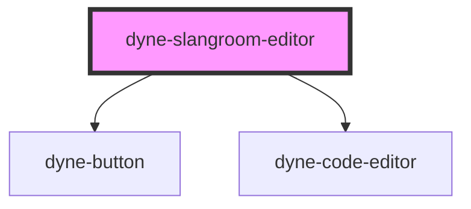

# dyne-slangroom-editor

<!-- Auto Generated Below -->

## Properties

| Property   | Attribute  | Description | Type     | Default |
| ---------- | ---------- | ----------- | -------- | ------- |
| `contract` | `contract` |             | `string` | `''`    |
| `data`     | `data`     |             | `string` | `''`    |
| `keys`     | `keys`     |             | `string` | `''`    |

## Methods

### `getContent() => Promise<SlangroomEditorContent>`

#### Returns

Type: `Promise<SlangroomEditorContent>`

## Dependencies

### Depends on

- [dyne-button](../dyne-button)
- [dyne-code-editor](../dyne-code-editor)

### Graph

----------------------------------------------

*Built with [StencilJS](https://stenciljs.com/)*
