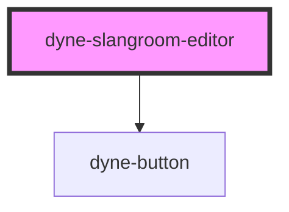

# dyne-slangroom-editor

<!-- Auto Generated Below -->

## Methods

### `getEditorContent() => Promise<string>`

#### Returns

Type: `Promise<string>`

### `setEditorContent(content: string) => Promise<void>`

#### Parameters

| Name      | Type     | Description |
| --------- | -------- | ----------- |
| `content` | `string` |             |

#### Returns

Type: `Promise<void>`

## Dependencies

### Depends on

- [dyne-button](../dyne-button)

### Graph

----------------------------------------------

*Built with [StencilJS](https://stenciljs.com/)*
