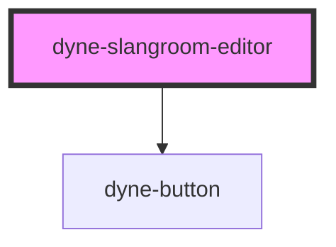

# dyne-slangroom-editor

<!-- Auto Generated Below -->

## Methods

### `getEditorContent(editorName: EditorName) => Promise<string>`

#### Parameters

| Name         | Type                           | Description |
| ------------ | ------------------------------ | ----------- |
| `editorName` | `"script" \| "data" \| "keys"` |             |

#### Returns

Type: `Promise<string>`

### `setEditorContent(editorName: EditorName, content: string) => Promise<void>`

#### Parameters

| Name         | Type                           | Description |
| ------------ | ------------------------------ | ----------- |
| `editorName` | `"script" \| "data" \| "keys"` |             |
| `content`    | `string`                       |             |

#### Returns

Type: `Promise<void>`

## Dependencies

### Depends on

- [dyne-button](../dyne-button)

### Graph

----------------------------------------------

*Built with [StencilJS](https://stenciljs.com/)*
