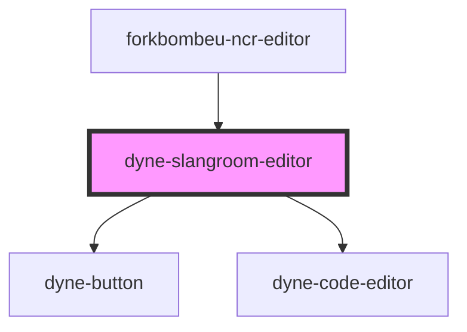

# dyne-slangroom-editor

<!-- Auto Generated Below -->

## Properties

| Property              | Attribute                | Description | Type                                   | Default     |
| --------------------- | ------------------------ | ----------- | -------------------------------------- | ----------- |
| `contract`            | `contract`               |             | `string`                               | `''`        |
| `data`                | `data`                   |             | `string`                               | `''`        |
| `keys`                | `keys`                   |             | `string`                               | `''`        |
| `keysLocalStorageKey` | `keys-local-storage-key` |             | `string \| undefined`                  | `undefined` |
| `keysMode`            | `keys-mode`              |             | `"editor" \| "localStorage" \| "none"` | `'editor'`  |
| `name`                | `name`                   |             | `string`                               | `''`        |

## Methods

### `getContent() => Promise<SlangroomEditorContent>`

#### Returns

Type: `Promise<SlangroomEditorContent>`

### `setContent(editor: EditorId, content: string) => Promise<void>`

#### Parameters

| Name      | Type       | Description |
| --------- | ---------- | ----------- |
| `editor`  | `EditorId` |             |
| `content` | `string`   |             |

#### Returns

Type: `Promise<void>`

## Dependencies

### Used by

 - [forkbombeu-ncr-editor](../forkbombeu-ncr-editor)

### Depends on

- [dyne-button](../dyne-button)
- [dyne-code-editor](../dyne-code-editor)

### Graph

----------------------------------------------

*Built with [StencilJS](https://stenciljs.com/)*
