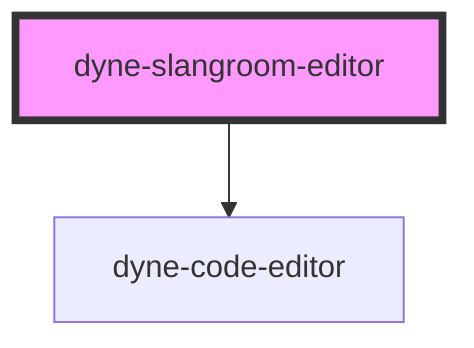

# dyne-slangroom-editor

<!-- Auto Generated Below -->

## Methods

### `getEditorContent() => Promise<string>`

#### Returns

Type: `Promise<string>`

### `setEditorContent() => Promise<void>`

#### Returns

Type: `Promise<void>`

## Dependencies

### Depends on

- [dyne-code-editor](../dyne-code-editor)

### Graph

----------------------------------------------

*Built with [StencilJS](https://stenciljs.com/)*
