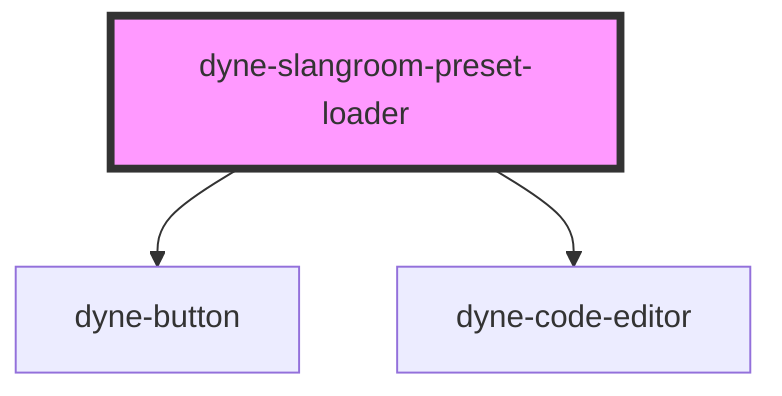

# dyne-slangroom-preset-loader

<!-- Auto Generated Below -->

## Properties

| Property           | Attribute            | Description | Type                  | Default     |
| ------------------ | -------------------- | ----------- | --------------------- | ----------- |
| `editorId`         | `editor-id`          |             | `string`              | `undefined` |
| `loadLocalPresets` | `load-local-presets` |             | `boolean`             | `true`      |
| `oasEndpoint`      | `oas-endpoint`       |             | `string \| undefined` | `undefined` |

## Dependencies

### Depends on

- [dyne-button](../dyne-button)
- [dyne-code-editor](../dyne-code-editor)

### Graph

----------------------------------------------

*Built with [StencilJS](https://stenciljs.com/)*
