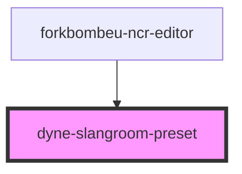

# dyne-slangroom-preset

<!-- Auto Generated Below -->

## Properties

| Property      | Attribute     | Description | Type     | Default |
| ------------- | ------------- | ----------- | -------- | ------- |
| `contract`    | `contract`    |             | `string` | `''`    |
| `data`        | `data`        |             | `string` | `''`    |
| `description` | `description` |             | `string` | `''`    |
| `group`       | `group`       |             | `string` | `''`    |
| `keys`        | `keys`        |             | `string` | `''`    |
| `name`        | `name`        |             | `string` | `''`    |

## Methods

### `getPreset() => Promise<SlangroomPreset>`

#### Returns

Type: `Promise<{ name: string; contract: string; keys: string; data: string; meta: { title: string; highlight: string; }; group: string; }>`

## Dependencies

### Used by

 - [forkbombeu-ncr-editor](../forkbombeu-ncr-editor)

### Graph

----------------------------------------------

*Built with [StencilJS](https://stenciljs.com/)*
