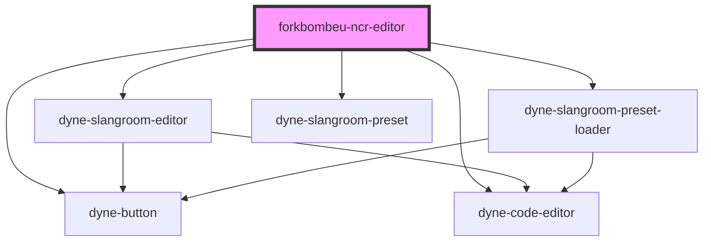

# forkbombeu-ncr-editor

<!-- Auto Generated Below -->

## Properties

| Property          | Attribute           | Description | Type     | Default     |
| ----------------- | ------------------- | ----------- | -------- | ----------- |
| `contract`        | `contract`          |             | `string` | `''`        |
| `data`            | `data`              |             | `string` | `''`        |
| `keys`            | `keys`              |             | `string` | `''`        |
| `metadata`        | `metadata`          |             | `string` | `''`        |
| `oasEndpoint`     | `oas-endpoint`      |             | `string` | `undefined` |
| `saveContractUrl` | `save-contract-url` |             | `string` | `undefined` |
| `schema`          | `schema`            |             | `string` | `''`        |

## Methods

### `getContent() => Promise<NcrEditorContent | undefined>`

#### Returns

Type: `Promise<NcrEditorContent | undefined>`

### `setContent(editor: EditorId | NcrExtensions, content: string) => Promise<void>`

#### Parameters

| Name      | Type                        | Description |
| --------- | --------------------------- | ----------- |
| `editor`  | `EditorId \| NcrExtensions` |             |
| `content` | `string`                    |             |

#### Returns

Type: `Promise<void>`

## Dependencies

### Depends on

- [dyne-slangroom-editor](../dyne-slangroom-editor)
- [dyne-slangroom-preset-loader](../dyne-slangroom-preset-loader)
- [dyne-slangroom-preset](../dyne-slangroom-preset)
- [dyne-button](../dyne-button)
- [dyne-code-editor](../dyne-code-editor)

### Graph

----------------------------------------------

*Built with [StencilJS](https://stenciljs.com/)*
